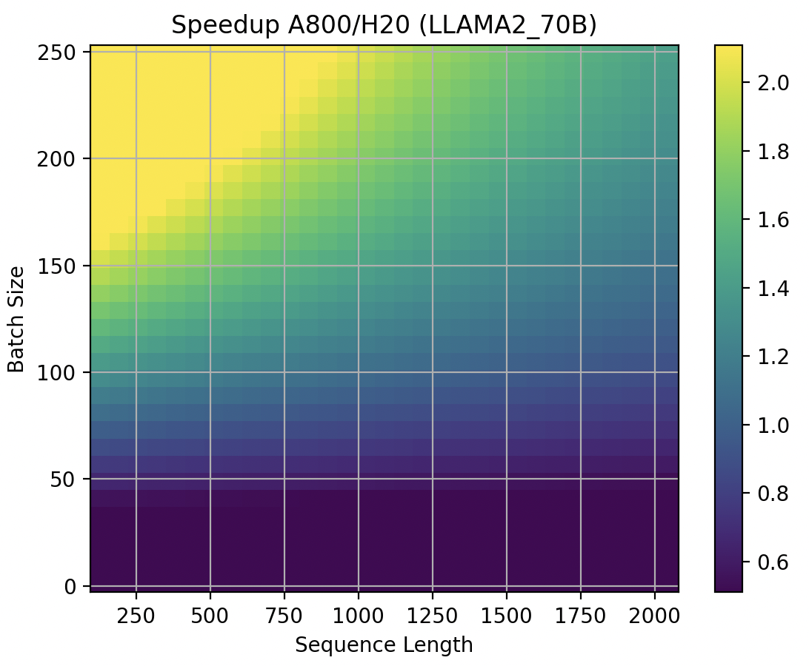
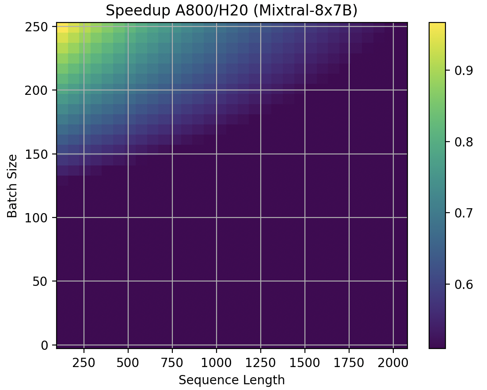

# Hardware Comparison for LLM Inference Tasks

This repo contains scripts that use the roofline model to compare the performance of Large Language Model (LLM) inference tasks on different hardware platforms.

In LLM inference tasks, there are multiple factors that affect performance on different hardware. I list them as follows:

- Batch Size: The batch size refers to the number of samples used to update the model weights in one iteration. A larger batch size may increase computational efficiency but may also increase memory requirements.

- KV Cache Length: In Transformer models, the KV cache length refers to the length of the cache used to store key-value pairs. This parameter may affect the model's memory requirements and computational efficiency.

- Model Hidden Size: The hidden size refers to the dimension of the hidden layers in the model. A larger hidden size may increase the complexity and memory requirements of the model, but it may also improve the model's performance.

- Intermediate Size: The intermediate size refers to the dimension of the fully connected layers in the model. This parameter may affect the complexity and memory requirements of the model.

- GQA: GQA can reduce KVCache memory consumption therefore reduce the memory bandwidth required to fetch them.

- MoE : MoE (Mixture of Experts) is a technique used to improve model performance. The configuration of MoE may affect the complexity and memory requirements of the model.

We present the speedup between two hardware in a mesh. For example:

For LLAMA2 70B, in some scenerios, A800 is better than H20 on, especially for large batch sizes.

For  Mixtral-8X7B MoE, A800 is always worse than H20.

